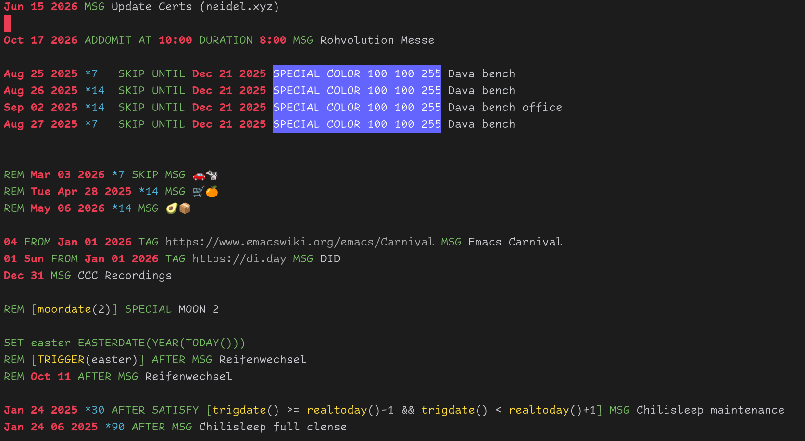

* remind-calendar-mode

A major mode that syntactically highlight ~.rem~ files for the [[https://dianne.skoll.ca/projects/remind/][remind calendar
system by Dianne Skoll]].

** Usage
To syntax highlight your ~.rem~ files:
#+begin_src elisp :lexical no
(use-package remind-calendar-mode
  :mode ("\\.rem\\'" . remind-calendar-mode)
  :quelpa (remind-calendar-mode :fetcher github :repo "jneidel/remind-calendar-mode"))
#+end_src

** References
- Alternative mode for remind files: [[https://github.com/sshelagh/remind-conf-mode][sshelagh/remind-conf-mode]]
