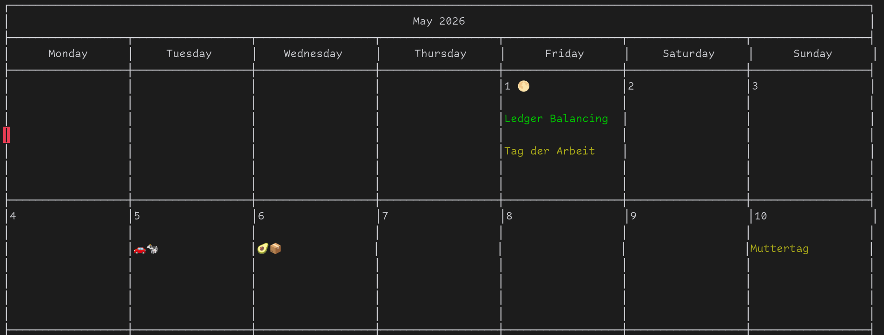

* remind-calendar-mode

A major mode that syntactically highlight ~.rem~ files for the [[https://dianne.skoll.ca/projects/remind/][remind calendar
system by Dianne Skoll]].

** Features
Syntax highlighting:
[[file:docs/syntax.png]]

Render the calendar (as a non-interactive colored pure-text buffer):

** Usage
To syntax highlight your ~.rem~ files:
#+begin_src elisp :lexical no
(use-package remind-calendar-mode
  :mode ("\\.rem\\'" . remind-calendar-mode)
  :quelpa (remind-calendar-mode :fetcher github :repo "jneidel/remind-calendar-mode"))
#+end_src

To view the calendar: =M-x remind-calendar= or ~C-c o~ inside of the major mode.

~C-c .~ to interactively pick a date, date time or date time range.
All are inserted in the appropriate format.

** References
- Alternative mode for remind files: [[https://github.com/sshelagh/remind-conf-mode][sshelagh/remind-conf-mode]]
